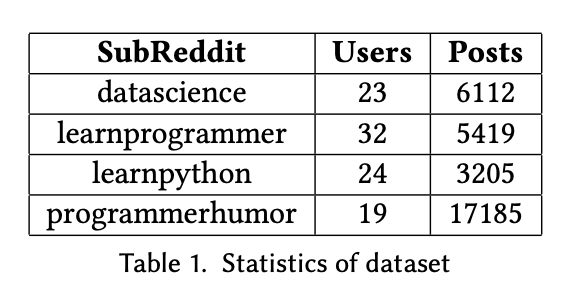
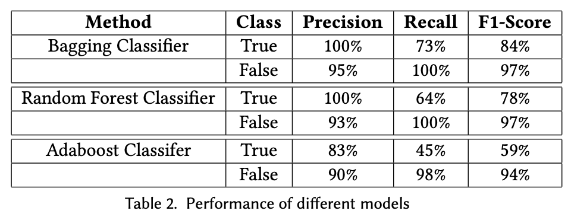
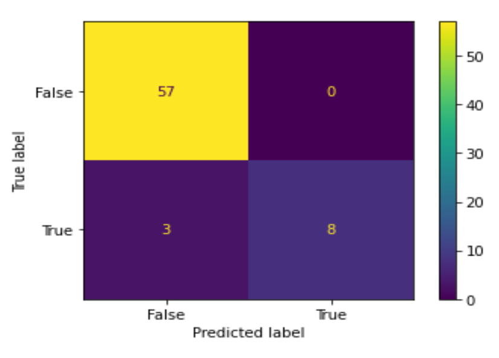

# Main idea of the project

Given two user profiles from heterogeneous online platforms, how can we predict whether they belong to the same user? 
User profile matching across different platforms has diverse applications including user behavioral analysis, 
cross-platform monitoring, crime investigation and so on. The task becomes challenging due to the unavailability of user’s demographic information, 
differing interplay inside the user network, privacy issues, and sometimes the intentional impersonation made by the malicious users. 
Our study presents a comprehensive strategy to measure the similarity between given user profiles analyzing the behavioral footprint available 
in the user generated contents. The key novelty of our approach is to focus on matching identities across platforms, 
where users share contents of varied interests and topics manipulating similarity of textual style and temporal activities. 
We consider Reddit platform as the best suit for our approach for its pool of sub forums called as subreddits to evaluate our results. 
We show that our approach presents excellent performance in terms of precision, recall and F-1 Score. 
We claim that user’s writing style pattern extracted from their contents and temporal similarity are resourceful 
features that can be exploited for user profile matching across heterogeneous online platforms for higher accuracy and performance.

# Key contribution
- The main contribution of our work is as follows:
- We calculate the similarity score between users based on similarity of writing style
- We calculate the temporal relatedness of user activities

# Dataset

We identify several top users of those subreddits. With the help of an online tool https://github.com/JakapunTachaiya/reddit_praw, 
we crawl 1094 threads including 62655 comments of 98 users across the platforms. 
As the users have the same identity for every subreddit, we have labeled them accordingly.

  

# Evaluation

We train three ML classifiers (Bagging, Random Forest and Ad- aboost) separately to do our experimentation. 
We consider Precision, Recall and F1-Score for metrics of performance evaluation of our approach. Accuracy alone might not judge the performance. 
So precision and recall offer greater significance in any analysis. Table 2 depicts that Bagging works relatively better than other 2 classifiers
in terms of Precision, Recall and F1-Score. All of the classifiers per- form quite well. 
The precision is over 80% for each of them which justify the algorithm that we propose.

  

Below figure shows the confusion matrix for Bagging Classifier. 
All the non-matching pairs have been properly detected by the classifier, though the model miss a few of matching pairs. 
This may happen as one of the profiles from a pair might have relatively less information than the other to measure the similarity among them.

  

